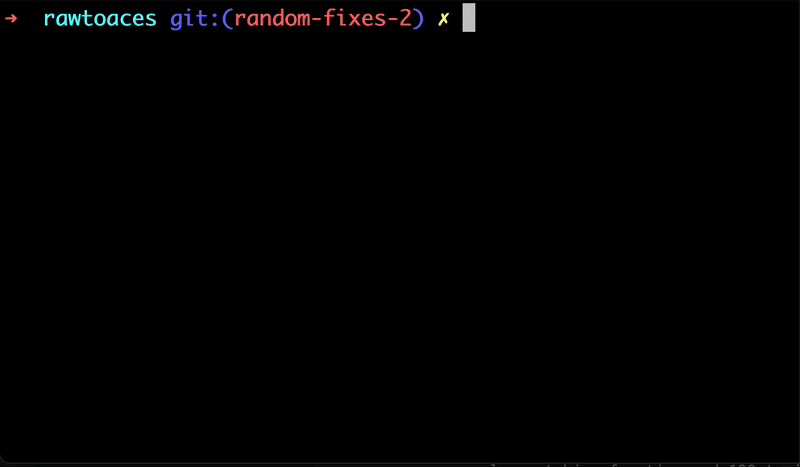

# last-branches



Super simple interactive CLI to list your most recent local git branches and checkout the one you pick.

## Install

Global install (recommended):

```bash
npm install -g last-branches-cli
# or
pnpm add -g last-branches-cli
# or (Yarn classic)
yarn global add last-branches-cli
```

Then run:

```bash
last-branches
```

Zero‑install (runs without a global install):

```bash
npx last-branches
# or
pnpm dlx last-branches
# or
bunx last-branches
```

## Usage

```bash
last-branches [-C <dir>] [-n <limit>] [-h|--help]
```

- `-C <dir>`: Run as if git was started in `<dir>`
- `-n <limit>`: Max branches to show (default 30)
- `-h, --help`: Show help

Examples:

```bash
# In a git repo
last-branches

# From anywhere, target a repo
last-branches -C ~/code/my-repo

# Show more branches
last-branches -n 100
```

## Requirements

- Node.js >= 16
- A git repository (local branches are listed)

## Build into a single Javascript file to be executed without `node_modules`

Run the following command:

```bash
npm run build
```

This will compile the Javascript source code with dev dependencies in `node_modules`. This will allow you to execute the Javascript file in a separate directly without `node_modules` or global dependencies present.

This can be useful in a dotfiles configuration folder with an alias that executes the Javascript file with node.

## Troubleshooting: command not found

Most Node installs expose the global bin directory on your `PATH`. If `last-branches` is not found after a global install:

1) Find the global bin directory:

```bash
npm bin -g
```

2) Add it to your shell profile:

- zsh (`~/.zshrc`):

```bash
echo 'export PATH="$PATH:$(npm bin -g)"' >> ~/.zshrc && exec zsh
```

- bash (`~/.bash_profile` or `~/.bashrc`):

```bash
echo 'export PATH="$PATH:$(npm bin -g)"' >> ~/.bash_profile && source ~/.bash_profile
```

If you use `nvm`, ensure its initialization snippet is present in your shell profile so the correct Node version's global bin is on `PATH`.

## Maintainers

Ensure the entry file is executable before publishing:

```bash
chmod +x bin/last-branches.js
```

## License

MIT
